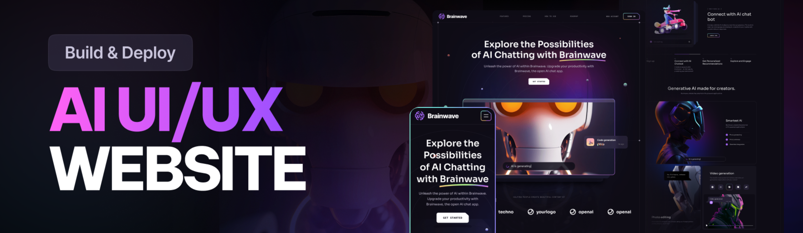

<h3 align="center">BrainWave - A Modern UI/UX Web Application</h3>

BrainWave is a modern UI/UX web application developed using React.js and Tailwind CSS. The project showcases sleek design elements, seamless animations, and an overall top-tier user experience. This application is designed to be a reference for anyone looking to build visually compelling and interactive websites with the latest web technologies.

<h4>⚙️ Tech Stack</h4>

1. Vite: A fast build tool for modern web applications.
2. React.js: JavaScript library for building user interfaces.
3. Tailwind CSS: A utility-first CSS framework for rapid UI development.

<h4>🔋 Features</h4>

1. Responsive Design: Optimized for all devices (desktop, tablet, mobile).
2. Beautiful Sections: Includes hero, features, roadmap, services, pricing, and more.
3. Parallax Effects: Interactive animations triggered by mouse movement and scrolling.
4. Complex UI Components: Designed using Tailwind CSS, including circular displays, grids, and side lines.
5. Modern UI Trends: Integrates latest design elements like bento grids and stylish gradients.
6. Interactive UI: Smooth transitions, hover effects, and stylish animations that improve user experience.
hello i am harman
